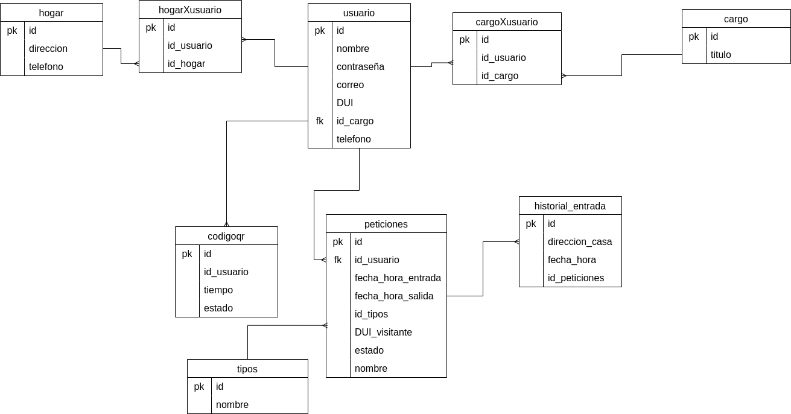

# Sistema de Seguridad y Control de Acceso Urbano - Backend

## Descripción
El backend del Sistema de Seguridad y Control de Acceso Urbano está diseñado para proporcionar una infraestructura robusta y segura para la gestión de entradas y salidas en una ciudad. Implementado con Spring Boot, PostgreSQL y Hibernate ORM, este sistema garantiza un rendimiento eficiente y una integración fluida con otras partes de la aplicación.

## Tecnologías Utilizadas
- **Spring Boot:** Framework principal para la creación de aplicaciones basadas en Java, que facilita la configuración y el desarrollo rápido.
- **PostgreSQL:** Base de datos relacional utilizada para el almacenamiento seguro y eficiente de datos.
- **Hibernate ORM:** Framework de mapeo objeto-relacional (ORM) que facilita la interacción con la base de datos.

## Características Principales
- **API RESTful:** Servicios RESTful para la gestión de usuarios, permisos y códigos QR.
- **Gestión de Usuarios:** Endpoints para el registro, autenticación y autorización de residentes y visitantes.
- **Gestión de Permisos:** Endpoints para la creación, revisión y aprobación de permisos de entrada.
- **Generación de Códigos QR:** Endpoints para la generación y validación de códigos QR únicos.
- **Manejo de Errores:** Gestión centralizada de errores y respuestas consistentes para los clientes.

## Base de datos

